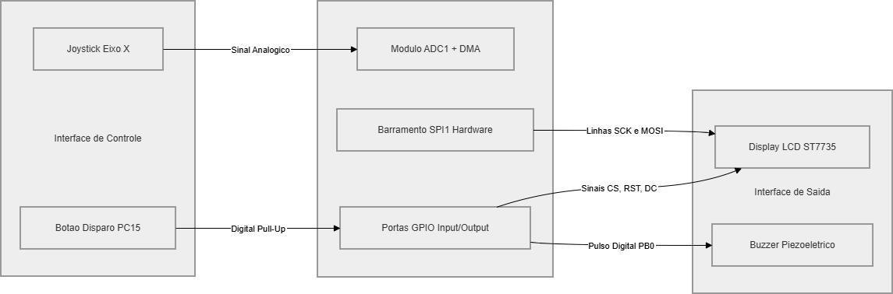

# 🛠️ Mapeamento de Hardware e Circuitos

Este documento descreve a topologia de hardware, a pinagem utilizada no microcontrolador **STM32F411CEU6 (Black Pill)** e a interface de conexão com os periféricos do jogo Space Invaders.

---

## 📌 Tabela de Pinagem (Pinout)

Para garantir o determinismo e a eficiência de hardware, os pinos foram mapeados tirando proveito de canais nativos de **DMA**, barramentos de comunicação por **Hardware (SPI)** e interrupções, evitando sobrecarregar a CPU.

| Periférico | Pino STM32 | Função Nativa | Descrição Técnica |
| :--- | :---: | :--- | :--- |
| **Display LCD ST7735** | `PA5` | SPI1_SCK | Clock do barramento serial SPI |
| | `PA7` | SPI1_MOSI | Transmissão de dados (Master Out Slave In) |
| | `PA6` | GPIO_Output | Data/Command (D/C) - Seleção de dados/comando |
| | `PA4` | GPIO_Output | Reset (RST) - Reinicialização do display |
| | `PA3` | GPIO_Output | Chip Select (CS) - Habilitação do periférico |
| **Joystick Analógico** | `PA0` | ADC1_IN0 | Eixo Horizontal (X) amostrado via **DMA** |
| **Botão de Disparo** | `PC15` | GPIO_Input | Botão de Click (Gatilho) com *Pull-Up* ativado |
| **Buzzer Piezoelétrico** | `PB0` | GPIO_Output | Saída digital para geração de bips acústicos |

---

## 🔌 Diagrama de Blocos de Conexões

O diagrama abaixo ilustra como os sinais elétricos e os barramentos de comunicação interligam a Black Pill aos elementos de interface humana (I/O) e de saída visual/sonora.

---

## ⚡ Detalhes de Implementação dos Periféricos

### 1. Comunicação com o Display (SPI por Hardware)
Em vez de simular o protocolo SPI por software (*bit-banging*), o sistema utiliza o periférico interno **SPI1** da ST. Operando com o clock de 96MHz da Black Pill, o barramento atinge taxas de transferência ideais para empurrar as matrizes de pixels dos sprites sem gerar atrasos na execução das tarefas do FreeRTOS.

### 2. Amostragem do Joystick (ADC + DMA)
A leitura do potenciômetro do eixo X do joystick é automatizada. O **ADC1** realiza a conversão analógico-digital e o **DMA (Direct Memory Access)** transfere o valor resultante diretamente para a memória RAM (na struct `game`). Isso significa que a CPU não gasta nenhum ciclo de clock esperando a conversão terminar.

### 3. Tratamento do Botão (Debouncing por Software)
O pino `PC15` monitora o botão de disparo. Para evitar o efeito de *bounce* (ruído elétrico de oscilação mecânica do botão que faz um único clique parecer vários), a tarefa `vTask_Input` faz uma leitura estável amostrada a cada 15ms, filtrando qualquer ruído por software.