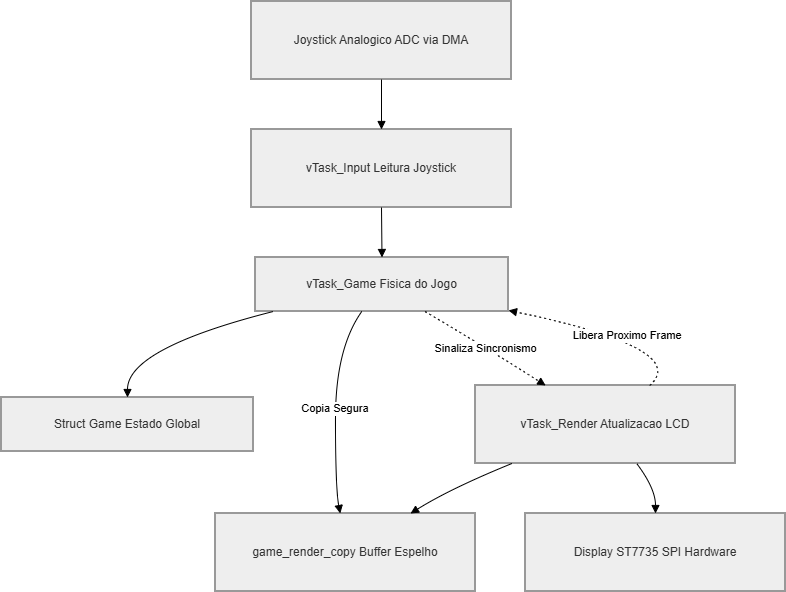

# 🚀 Space Invaders STM32 (FreeRTOS)

Este é um jogo estilo **Space Invaders** desenvolvido para o microcontrolador **STM32F411CE (Black Pill)** utilizando o sistema operacional de tempo real **FreeRTOS (CMSIS-RTOS V2)**. O projeto demonstra a aplicação prática de boas práticas de sistemas embarcados, focando em sincronização de tarefas, temporização precisa e otimização de periféricos via hardware.

---

## 🎨 Visão Geral da Arquitetura

O comportamento do sistema é orquestrado por quatro tarefas principais operando concorrentemente sob o escalonador do FreeRTOS. Elas comunicam-se através de semáforos e buffers isolados para garantir alto desempenho de tela sem travar as rotinas críticas da CPU:



> 📘 **Detalhamento Avançado:** Para entender a fundo o funcionamento dos semáforos, a exclusão mútua por Mutex, as prioridades das tarefas e o espelhamento das estruturas de dados (`Game`), acesse o documento técnico completo de [Arquitetura de Software (ARCHITECTURE.md)](ARCHITECTURE.md).

---

## 🛠️ Especificações de Hardware

* **Microcontrolador:** STM32F411CEU6 (Black Pill) baseado em ARM Cortex-M4 @ 96MHz.
* **Display:** LCD TFT ST7735 (Resolução 128x160) via barramento SPI1 por Hardware.
* **Controle:** Joystick Analógico de 2 eixos (Eixo X amostrado por ADC1 com transferência automatizada via DMA) + Botão de Disparo (`PC15`) com resistor de *pull-up* ativo.
* **Áudio:** Transdutor acústico piezoelétrico (Buzzer) operando via acionamento digital direto em GPIO (`PB0`).

---

## ⚙️ Como Compilar e Executar

1. Instale o ambiente oficial **STM32CubeIDE** (versão estável mais recente).
2. Inicialize o seu workspace e efetue o clone do repositório através do terminal:
   ```bash
   git clone [https://github.com/seu-usuario/nome-do-repositorio.git](https://github.com/seu-usuario/nome-do-repositorio.git)
3. Importe o diretório clonado para dentro do ecossistema do STM32CubeIDE (`File` -> `Import` -> `Existing Projects into Workspace`).
4. Conecte a placa de desenvolvimento **Black Pill** ao computador utilizando uma ferramenta de depuração/gravação baseada no protocolo SWD (como o **ST-Link v2**).
5. No menu superior da IDE, clique no ícone do **Martelo (Build)** para processar o compilador GCC e gerar os binários `.elf` e `.bin`.
6. Após a compilação sem erros, clique em **Run** ou **Debug** (ícone do besouro) para gravar o firmware diretamente na memória Flash do microcontrolador.

---

## 🤠 Gostou do projeto?

Se este projeto de sistema de tempo real foi útil para os seus estudos ou serviu de inspiração, considere deixar uma ⭐ no repositório! 

Contribuições, relatórios de *bugs* e sugestões de otimização na topologia das tarefas são sempre bem-vindos através de *Pull Requests*.